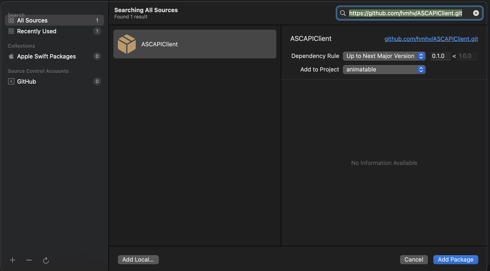

[한글](README_KR.md)　 | 　[日本語](README_JP.md)

# Swift client for App Store Connect API with Swift Concurrency (async/await)

generated by [App Store Connect API OpenAPI specification](https://developer.apple.com/documentation/appstoreconnectapi) and [OpenAPI Generator](https://openapi-generator.tech), 
and some manual changes.

## Installation

### Swift Package Manager

#### ● Xcode
1. Open your Xcode project
2. Select `File -> Add Packages...`
3. Enter `https://github.com/hmhv/ASCAPIClient.git` in search field and select `ASCAPIClient`



#### ● Package.swift

adding `ASCAPIClient` as a dependency is as easy as adding it to the `dependencies` value of your `Package.swift`.

```swift
dependencies: [
    .package(url: "https://github.com/hmhv/ASCAPIClient.git", .upToNextMajor(from: "3.4.2"))
]
```

## How to use
Check [ASCAPIClient-Example-iOS](https://github.com/hmhv/ASCAPIClient-Example-iOS).

## How to generate

used command for code generation

```bash
brew install openapi-generator

openapi-generator generate -i ./raw_data/app_store_connect_api_openapi.json -t ./raw_data/swift_template -g swift5 --additional-properties=responseAs=AsyncAwait,projectName=ASC,useSPMFileStructure=true,enumUnknownDefaultCase=true -o ./ASC
```

used spec file and template files are [here](./raw_data).

[Generated README.md by openapi-generator](./Docs.md)
