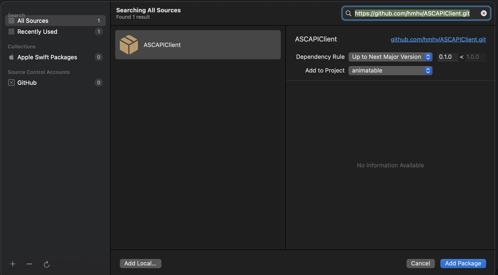

# Swift client for App Store Connect API with Swift Concurrency (async/await)

[App Store Connect API OpenAPI specification](https://developer.apple.com/documentation/appstoreconnectapi) 과 [OpenAPI Generator](https://openapi-generator.tech)를 이용하여 생성하고, 조금만 수정.

## Installation

### Swift Package Manager

#### ● Xcode
1. Xcode project를 기동
2. 메뉴에서 `File -> Add Packages...`를 선택
3. 검색창에 `https://github.com/hmhv/ASCAPIClient.git`을 입력후、`ASCAPIClient`를 선택



#### ●　Package.swift
`Package.swift`에서 `dependencies`에 `ASCAPIClient`を追加

```swift
dependencies: [
    .package(url: "https://github.com/hmhv/ASCAPIClient.git", .upToNextMajor(from: "3.4.2"))
]
```

## How to use
[ASCAPIClient-Example-iOS](https://github.com/hmhv/ASCAPIClient-Example-iOS)를 확인해 주세요.

### How to generate

생성시에 사용한 명령어

```bash
brew install openapi-generator

openapi-generator generate -i ./raw_data/app_store_connect_api_openapi.json -t ./raw_data/swift_template -g swift5 --additional-properties=responseAs=AsyncAwait,projectName=ASC,useSPMFileStructure=true,enumUnknownDefaultCase=true -o ./ASC
```

생성시에 사용한 스펙파일과 템플릿은 [여기에](./raw_data).

[Generated README.md by openapi-generator](./Docs.md)
